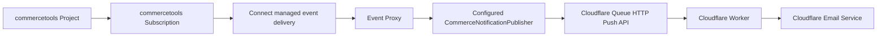

# Cloudflare Email Worker Follow-Up Plan

## Purpose

Replace the previous NATS email-service consumer path with a Cloudflare-native email pipeline using Cloudflare Queues, Workers, and Cloudflare Email Service.

## Recommended Architecture



## Repository Location

Implement the Cloudflare Worker in a root-level module named `email-worker`.

```text
/
├── connect.yaml
├── CONTEXT.md
├── docs/
├── event-proxy/
│   ├── package.json
│   └── src/
└── email-worker/
    ├── package.json
    ├── wrangler.toml
    └── src/
```

Reasoning:

- `event-proxy` is the commercetools Connect app.
- `email-worker` is the Cloudflare Worker app.
- They have different runtimes, deployment tools, configuration, and tests.
- Keeping them as siblings preserves the boundary: the Event Proxy forwards Commerce Notifications, while the Worker owns email behavior.

Recommended `email-worker` structure:

```text
email-worker/src/
├── index.ts                         # queue consumer entrypoint
├── queue/
│   └── handler.ts                   # batch loop and explicit message-type dispatch
├── notifications/
│   └── order-created/
│       ├── handler.ts               # type guard and OrderCreated workflow
│       └── template.ts              # renderOrderCreatedEmail
├── dedupe/
│   └── kv-dedupe-store.ts           # sent:${notification.id}
└── stats/
    └── counters.ts                  # operational counters
```

## Recommendation

Use **Cloudflare Queues** for the outbound queue when the real email service is a Cloudflare Worker.

Why:

- Cloudflare Workers consume Cloudflare Queues natively.
- Workers can send email directly through the Cloudflare Email Service `EMAIL` binding.
- No bridge service is needed.
- Queue retry and batching stay inside Cloudflare.
- The Event Proxy remains a pass-through: it receives Commerce Notifications and forwards the configured subset.

## Event Proxy Responsibility

The Event Proxy should stay a boundary component.

It should:

- Receive Commerce Notifications from Connect-managed event delivery.
- Unwrap Connect transport envelopes if needed.
- Parse the Commerce Notification as JSON at the publisher seam and publish it through the configured `CommerceNotificationPublisher` adapter.
- Apply an optional message-type allowlist before publishing to reduce downstream queue noise.
- Return success only after queue publish succeeds.
- In development, optionally store a bounded in-memory inspection log.
- In development, optionally run in dry-run mode without publishing to Cloudflare Queue.

It should not:

- Decide whether an email should be sent.
- Choose recipients.
- Choose templates.
- Apply suppression or consent rules.
- Deduplicate email sends.
- Normalize Commerce Notifications into email commands.

Message-type filtering is traffic control, not email intent. The Event Proxy can decide whether a Commerce Notification is forwarded, but the Worker still decides what an Email Event means for email workflows.

## Development Visibility And Cost Control

Development should support broad Commerce Notification discovery without creating unnecessary Cloudflare Queue or email traffic.

Recommended development mode:

```text
CT_MESSAGE_RESOURCE_TYPES=approval-flow,approval-rule,associate-role,business-unit,category,customer,customer-email-token,customer-group,customer-password-token,inventory-entry,order,payment,product,product-selection,product-tailoring,quote,quote-request,review,shopping-list,staged-quote,standalone-price,store
CT_MESSAGE_TYPES=
DEV_INSPECTION_ENABLED=true
DEV_INSPECTION_MAX_MESSAGES=100
DRY_RUN_FORWARDING=true
```

Behavior:

- Subscribe broadly in the commercetools development Project.
- Receive real Commerce Notifications through Connect.
- Store only the last N Commerce Notifications in memory.
- Expose the inspection log through development-only HTTP endpoints.
- Do not publish to Cloudflare Queue while `DRY_RUN_FORWARDING=true`.
- Do not send emails.

Development inspection endpoints:

| Method | Path | Purpose |
| --- | --- | --- |
| `GET` | `/event-proxy/dev/messages` | List recent in-memory Commerce Notifications. |
| `GET` | `/event-proxy/dev/messages/:id` | Return one in-memory Commerce Notification by inspection ID. |
| `DELETE` | `/event-proxy/dev/messages` | Clear the inspection log. |

The inspection log is not durable and is not an audit log. It is a development tool only.

Staging mode:

```text
DEV_INSPECTION_ENABLED=true
DEV_INSPECTION_MAX_MESSAGES=100
DRY_RUN_FORWARDING=false
```

Behavior:

- Forward to Cloudflare Queue.
- Keep bounded inspection visibility while validating queue delivery.
- Keep Worker email sending disabled until email templates, deduplication, and recipient rules are ready.

Production mode:

```text
DEV_INSPECTION_ENABLED=false
DRY_RUN_FORWARDING=false
```

Behavior:

- No inspection endpoint.
- Forward to Cloudflare Queue.
- Worker email sending can be enabled independently after deduplication and safeguards exist.

Bill-safety controls:

- Use dry-run forwarding during broad payload discovery.
- Keep the Worker email sender disabled until explicitly enabled.
- Keep the in-memory inspection log capped by `DEV_INSPECTION_MAX_MESSAGES`.
- Narrow `CT_MESSAGE_RESOURCE_TYPES` later only when the team has learned which resource types matter.
- Leave `CT_MESSAGE_TYPES` empty during broad discovery, then set it in staging or production to an allowlist such as `OrderCreated` to avoid publishing irrelevant Commerce Notifications.
- Configure Cloudflare Queue retry and dead-letter behavior before real email sending.
- Add a daily email send cap in the Worker before sending production emails.
- Keep `MAX_BODY_BYTES` below the Cloudflare Queue 128 KB message limit. The Event Proxy defaults to `90000` because Commerce Notifications are base64-encoded inside a JSON Queue message.

Connect configuration note:

- `connect.yaml` uses `inheritAs.apiClient.scopes` with `manage_subscriptions` so Connect generates the commercetools API credentials used by deployment scripts.
- This removes the need to configure `CTP_PROJECT_KEY`, `CTP_CLIENT_ID`, `CTP_CLIENT_SECRET`, and `CTP_SCOPE` manually during deployment.
- Subscription delivery format is fixed to Platform because the Cloudflare Worker consumes Platform Commerce Notification JSON directly.
- Publisher-specific credentials should live in one secured JSON environment variable, `OUTBOUND_PUBLISHER_CONFIG`, rather than one Connect configuration key per provider credential.
- `OUTBOUND_PUBLISHER_CONFIG` selects exactly one publisher adapter at a time. The initial value uses `{ "type": "cloudflare-queue", "accountId": "...", "queueId": "...", "apiToken": "..." }`.
- Migrate `connect.yaml` and `event-proxy` config parsing together so deployment config and runtime config do not drift.

Do not use sampling as a primary cost-control mechanism. Sampling can hide important Commerce Notification shapes during discovery and makes debugging less deterministic.

## Cloudflare Worker Responsibility

The Worker becomes the email service.

It should:

- Consume Commerce Notifications from Cloudflare Queue.
- Parse Platform-format Commerce Notifications.
- Dispatch supported message types to per-notification-type handlers.
- Keep type guards as a safety net and acknowledge ignored Commerce Notifications.
- Decide recipient, template, localization, and suppression behavior.
- Deduplicate sends.
- Send email through Cloudflare Email Service.
- Ack successfully handled queue messages.
- Let failed messages retry where appropriate.

## Cloudflare Email Service Setup

Prerequisites from Cloudflare docs:

- The sending domain must use Cloudflare DNS.
- The domain must be onboarded under Cloudflare **Email Sending**.
- Cloudflare configures DNS records for bounce handling, SPF, DKIM, and DMARC.

Worker binding example:

```toml
[[send_email]]
name = "EMAIL"
remote = true
```

Worker send example:

```ts
await env.EMAIL.send({
  to: "recipient@example.com",
  from: "orders@yourdomain.com",
  subject: "Order confirmed",
  html: "<h1>Thanks for your order</h1>",
  text: "Thanks for your order",
});
```

## Minimal Worker Shape

```ts
import { handleOrderCreated } from "./notifications/order-created/handler";

export default {
  async queue(batch, env) {
    for (const message of batch.messages) {
      const notification = message.body;

      switch (notification?.type) {
        case "OrderCreated":
          await handleOrderCreated(notification, message, env);
          break;

        default:
          message.ack();
      }
    }
  },
};
```

## Migration Options

### Selected Option: Publisher Interface With Cloudflare Queue Adapter

Best if Cloudflare Worker is definitely the email runtime.

Changes:

- Keep outbound delivery behind a `CommerceNotificationPublisher` interface.
- Implement the first adapter as a Cloudflare Queue HTTP publisher.
- Configure the selected adapter through `OUTBOUND_PUBLISHER_CONFIG`.
- Add optional `CT_MESSAGE_TYPES` proxy filtering before publishing.
- Forward parsed Commerce Notification JSON directly to Cloudflare Queue.
- Add dry-run forwarding mode.
- Add development-only bounded inspection endpoints.
- Update tests to assert publisher calls and filtering behavior.

Pros:

- Simplest Cloudflare-native path.
- No bridge service.
- Queue and Worker integration is direct.

Cons:

- First adapter is Cloudflare-specific.
- `OUTBOUND_PUBLISHER_CONFIG` is less self-documenting in Connect UI than separate provider-specific fields.

## Implementation Plan

### Phase 1: Introduce A Publisher Interface

Goal: make outbound delivery swappable without changing the Connect ingestion path.

Tasks:

- Create a generic `CommerceNotificationPublisher` interface.
- Move outbound delivery behind a `CommerceNotificationPublisher` interface.
- Select a publisher adapter from runtime configuration.
- Keep tests focused on publisher calls rather than concrete queue internals.

Acceptance checks:

- Existing unit tests pass.
- Event Proxy can be run in dry-run mode without an Email Worker.

### Phase 2: Add Dev Inspection Store

Goal: provide payload visibility without Queue or email cost.

Tasks:

- Add `DEV_INSPECTION_ENABLED`, default `false`.
- Add `DEV_INSPECTION_MAX_MESSAGES`, default `100`.
- Implement an in-memory ring buffer storing raw Commerce Notification payloads plus metadata such as received time, size, and forwarding result.
- Add `GET /event-proxy/dev/messages`.
- Add `GET /event-proxy/dev/messages/:id`.
- Add `DELETE /event-proxy/dev/messages`.
- Ensure endpoints return `404` or are not registered when `DEV_INSPECTION_ENABLED=false`.

Acceptance checks:

- Dry-run Commerce Notifications appear in the inspection log.
- Log size never exceeds `DEV_INSPECTION_MAX_MESSAGES`.
- Inspection endpoints are unavailable when disabled.

### Phase 3: Add Dry-Run Forwarding

Goal: allow broad Commerce Notification discovery without outbound Queue cost.

Tasks:

- Add `DRY_RUN_FORWARDING`, default `false`.
- When enabled, receive and inspect Commerce Notifications but do not call the outbound publisher.
- Return `200` after successful inspection/logging.
- Log `dryRun: true` without logging raw payloads to stdout.

Acceptance checks:

- No outbound publisher call happens in dry-run mode.
- HTTP response is `200` for accepted dry-run messages.
- Inspection log still captures the message when enabled.

### Phase 4: Add Direct Cloudflare Queue Publisher

Goal: publish raw Commerce Notifications through the Cloudflare Queue HTTP Push API.

Tasks:

- Add Event Proxy configuration:
  - `OUTBOUND_PUBLISHER_CONFIG`
- Implement `CloudflareQueuePublisher` using the Cloudflare Queue HTTP Push API.
- Publish Platform Commerce Notification JSON as the Cloudflare Queue message body so the Worker can filter by `notificationType` and `type` directly.
- Add optional `CT_MESSAGE_TYPES` allowlist filtering in the Event Proxy.
- Return non-2xx from the proxy when enqueue fails.

Acceptance checks:

- Unit tests verify Cloudflare Queue HTTP request body.
- Queue publish failure returns `503`.
- Dry-run mode bypasses Cloudflare Queue publish.

### Phase 5: Add Worker Email Consumer Skeleton

Goal: consume from Cloudflare Queue without sending production emails yet.

Tasks:

- Create a Worker project or module for queue consumption.
- Add Cloudflare Email Service `EMAIL` binding.
- Parse Platform Commerce Notifications in the Worker.
- Log recognized message types without sending emails by default.
- Add `EMAIL_SENDING_ENABLED=false` default.

Acceptance checks:

- Worker receives queue messages.
- Worker does not send emails unless `EMAIL_SENDING_ENABLED=true`.
- Worker can send a manually triggered test email through Cloudflare Email Service.

### Phase 6: Add Email Safety Before Real Sends

Goal: avoid duplicate or excessive real email sends.

Tasks:

- Add deduplication state in the Worker.
- Add a daily email send cap.
- Add recipient/template allowlists for early testing.
- Log email send failures and acknowledge queue messages. Do not retry email sending in the Worker MVP.

Acceptance checks:

- Duplicate Commerce Notifications do not send duplicate emails.
- Send cap prevents runaway email volume.
- Failed email sends are logged and acknowledged without retry.

## Resolved Decisions

These decisions are locked for the implementation pass unless a new hard constraint appears.

| Decision | Resolution |
| --- | --- |
| Cloudflare Queue names | Use `commerce-notifications-email-dev` for development and `commerce-notifications-email` for production. |
| Allowed sender | Send all emails from `shelfmarket@tylko.dev`. |
| First email trigger | Send only for Platform-format Commerce Notifications where `notificationType` is `Message` and `type` is `OrderCreated`. |
| Deduplication state | Use Cloudflare KV for MVP with keys like `sent:${notification.id}` and a 30-day TTL. |
| Template location | Keep MVP templates in Worker code, starting with `renderOrderCreatedEmail`. |
| Email send retries | Do not retry email sending in the Worker MVP. Log failures and acknowledge the queue message. |
| Previous NATS transport | Removed in favor of direct Cloudflare Queue HTTP publishing. |
| Worker module location | Implement the Cloudflare Worker in root-level `email-worker/`. |
| Proxy message-type filtering | Add optional `CT_MESSAGE_TYPES` as a comma-separated allowlist. Empty means no proxy-level message-type filtering. |
| Publisher configuration | Use one secured JSON environment variable, `OUTBOUND_PUBLISHER_CONFIG`, for provider-specific publisher credentials. |
| Publisher fan-out | Support one publisher adapter at a time. Do not design fan-out for the MVP. |
| Worker notification dispatch | Use explicit per-type dispatch with handler directories such as `notifications/order-created/`. |

## References

- Cloudflare Email Service docs: `https://developers.cloudflare.com/email-service/get-started/send-emails/`
