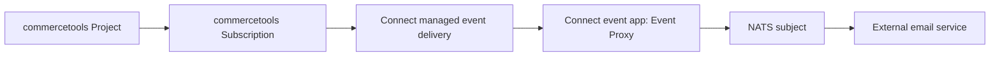

# commercetools Event Proxy MVP Plan

> Superseded: the implementation has moved from NATS to `email-worker` plus Cloudflare Queues. See `docs/plans/cloudflare-email-worker.md` for the current plan.

## Purpose

Build a minimal commercetools Connect application that receives Commerce Notifications through Connect-managed event delivery and forwards them unchanged to NATS for a downstream email service.

The Event Proxy must not decide email intent. It does not choose recipients, templates, suppression rules, or whether an email should be sent.

## Current Repository State

The workspace is greenfield. Existing files are:

- `CONTEXT.md`: domain glossary for the Event Proxy.
- `EVENT_PROXY_MVP_PLAN.md`: this plan.

## Resolved Decisions

| Decision | Resolution |
| --- | --- |
| Canonical inbound term | `Commerce Notification` |
| Canonical outbound term | `Email Event` |
| Proxy responsibility | Forward only; no email intent decisions |
| Payload contract | Raw pass-through by default |
| Inbound delivery | commercetools Connect-managed event delivery |
| Outbound delivery | NATS |
| HTTP inspection | Out of MVP unless it can be solved inside one app without extra architecture |
| NATS subject strategy | One configured subject for MVP |
| NATS delivery mode | Plain NATS pub/sub for MVP |
| NATS failure behavior | Return non-2xx if publish fails |
| NATS connection | Persistent connection per app process |
| Subscription category | Message subscriptions only |
| Initial resource scope | All supported Message resource types in dev, configurable before production |
| Subscription delivery format | Platform |
| Deduplication | None in proxy |
| Payload parsing | None in forwarding path |
| Subscription management | Automatic in `postDeploy` and `preUndeploy` |
| Subscription update behavior | Idempotent update by key; fail on unexpected shape |
| Subscription filters | Resource types only in MVP; no message `types` filters |
| commercetools API scope | Start with `manage_subscriptions:{projectKey}` |
| NATS auth mode | Token auth only for MVP |
| NATS TLS requirement | No application-level enforcement in MVP |
| Config validation | Fail fast for missing required config, including NATS token |
| Request body limit | Configurable `MAX_BODY_BYTES`; return `413` if exceeded |
| Implementation language | TypeScript |
| HTTP framework | Follow commercetools Connect TypeScript template/examples; preserve raw body |
| NATS publish timeout | `NATS_PUBLISH_TIMEOUT_MS`, default `2000` |
| NATS headers | Only transport-level headers such as `Content-Type` |
| Payload logging | No raw payload logging in MVP |
| Local testing | Local NATS plus sample Platform payload POSTs |
| Connect transport envelopes | Unwrap Google Pub/Sub/SNS outer envelopes; forward inner Commerce Notification bytes unchanged |

## Recommended MVP Architecture



Use one Connect `event` application for the MVP.

Reasoning:

- It avoids managing inbound Google Pub/Sub topics, IAM, pull subscriptions, push auth, and lifecycle behavior.
- It matches the desired responsibility: receive a Commerce Notification and forward it.
- It avoids adding a separate HTTP service app for inspection state.
- It keeps the app small enough to validate Connect delivery and NATS delivery first.

## Out of Scope for MVP

- Email routing decisions.
- Recipient, template, suppression, localization, or consent decisions.
- Payload normalization unless a transport boundary strictly requires it.
- Durable event log.
- HTTP inspection API.
- Replay endpoint.
- Filtering by event type inside the proxy.
- Change subscriptions.
- commercetools Event subscriptions for Checkout/import events.

## Connect App Shape

Use the commercetools Connect TypeScript starter template and keep one application folder, for example `event-proxy`.

Follow the framework and structure used by the official commercetools Connect TypeScript template/examples. Configure request handling so the Commerce Notification body is forwarded as raw bytes and is not JSON-parsed in the forwarding path.

Example `connect.yaml` direction:

```yaml
deployAs:
  - name: event-proxy
    applicationType: event
    endpoint: /event-proxy
    scripts:
      postDeploy: npm install && npm run build && npm run connector:post-deploy
      preUndeploy: npm install && npm run build && npm run connector:pre-undeploy
    configuration:
      standardConfiguration:
        - key: CTP_REGION
          description: commercetools Composable Commerce API region
          required: true
        - key: CTP_PROJECT_KEY
          description: commercetools Composable Commerce project key
          required: true
        - key: CT_SUBSCRIPTION_KEY
          description: Key of the commercetools Subscription managed by this Connector
          required: false
          default: email-events-proxy
        - key: CT_MESSAGE_RESOURCE_TYPES
          description: Comma-separated list of Message resource types to subscribe to
          required: false
          default: approval-flow,approval-rule,associate-role,business-unit,category,customer,customer-email-token,customer-group,customer-password-token,inventory-entry,order,payment,product,product-selection,product-tailoring,quote,quote-request,review,shopping-list,staged-quote,standalone-price,store
        - key: CT_DELIVERY_FORMAT
          description: commercetools Subscription delivery format, either Platform or CloudEvents
          required: false
          default: Platform
        - key: NATS_URL
          description: NATS server URL
          required: true
        - key: NATS_SUBJECT
          description: NATS subject to publish Email Events to
          required: false
          default: commerce-notifications.email
        - key: MAX_BODY_BYTES
          description: Maximum accepted Commerce Notification request body size in bytes
          required: false
          default: "1048576"
        - key: NATS_PUBLISH_TIMEOUT_MS
          description: Timeout for publishing a Commerce Notification to NATS
          required: false
          default: "2000"
      securedConfiguration:
        - key: CTP_CLIENT_ID
          description: commercetools API client ID for deployment scripts
          required: true
        - key: CTP_CLIENT_SECRET
          description: commercetools API client secret for deployment scripts
          required: true
        - key: CTP_SCOPE
          description: commercetools API client scope for deployment scripts
          required: true
        - key: NATS_AUTH_TOKEN
          description: NATS authentication token
          required: true
```

## Application Behavior

The app is called by Connect through `POST /event-proxy` with the Commerce Notification payload.

For each request:

1. Read the raw request body.
2. If Connect delivered an outer Google Pub/Sub or SNS envelope, extract the inner Commerce Notification bytes.
3. Publish the Commerce Notification bytes to the configured NATS subject.
4. Preserve `Content-Type` where possible.
5. Return HTTP `200` only after NATS publish succeeds.
6. Return a non-2xx response if NATS publish fails, so Connect can retry delivery according to its delivery behavior.
7. Return `503` if NATS publish does not complete within `NATS_PUBLISH_TIMEOUT_MS`.

The app should not:

- Inspect the payload to decide whether to forward.
- Convert CloudEvents to Platform format or Platform format to CloudEvents.
- Drop Commerce Notifications based on resource type or message type after the Subscription has delivered them.
- Add email-domain commands.
- Deduplicate Commerce Notifications.
- Parse payloads in the forwarding path.

The only allowed parsing is outer transport-envelope adaptation required by Connect delivery, such as decoding Google Pub/Sub `message.data` or AWS SNS `Message`. The app must not parse the inner Commerce Notification for business meaning.

MVP logging should avoid Commerce Notification parsing. Log transport-level facts such as request size, published size, publish duration, NATS subject, and success/failure.

## NATS Publishing Contract

Publish every Commerce Notification to one configured NATS subject.

Default subject:

```text
commerce-notifications.email
```

Payload:

- Raw Commerce Notification bytes.
- If Connect delivers an outer transport envelope, the envelope is removed and the inner Commerce Notification bytes are published unchanged.

NATS headers:

- Use only transport-level data.
- Include `Content-Type` if available.
- Do not derive headers by parsing the payload.
- Never required by the email service in the MVP.

## commercetools Subscription Scope

Use Message subscriptions only.

Initial dev resource types:

```json
[
  { "resourceTypeId": "approval-flow" },
  { "resourceTypeId": "approval-rule" },
  { "resourceTypeId": "associate-role" },
  { "resourceTypeId": "business-unit" },
  { "resourceTypeId": "category" },
  { "resourceTypeId": "customer" },
  { "resourceTypeId": "customer-email-token" },
  { "resourceTypeId": "customer-group" },
  { "resourceTypeId": "customer-password-token" },
  { "resourceTypeId": "inventory-entry" },
  { "resourceTypeId": "order" },
  { "resourceTypeId": "payment" },
  { "resourceTypeId": "product" },
  { "resourceTypeId": "product-selection" },
  { "resourceTypeId": "product-tailoring" },
  { "resourceTypeId": "quote" },
  { "resourceTypeId": "quote-request" },
  { "resourceTypeId": "review" },
  { "resourceTypeId": "shopping-list" },
  { "resourceTypeId": "staged-quote" },
  { "resourceTypeId": "standalone-price" },
  { "resourceTypeId": "store" }
]
```

Before production, narrow `CT_MESSAGE_RESOURCE_TYPES` to the explicit resource types required by the email service.

## Subscription Delivery Format

Use `Platform` format for the MVP.

Reasoning:

- The proxy forwards raw commercetools Commerce Notifications.
- The email service is expected to consume commercetools-originated payloads directly.
- Platform format avoids an extra CloudEvents wrapper.
- Platform format keeps fields such as `type`, `resource`, and `sequenceNumber` at the top level.

CloudEvents can be revisited later if the outbound stream needs a standard envelope shared with non-commercetools producers.

## NATS Delivery Mode

Use plain NATS pub/sub for the MVP.

Reasoning:

- It is simpler than JetStream.
- It is sufficient for early inspection and integration validation.
- NATS and JetStream are both available in the self-hosted open-source NATS server, so upgrading later does not require a vendor change.

Limitations:

- Plain NATS does not retain messages for offline subscribers.
- If the email service is disconnected after NATS accepts the publish, the message can be missed.
- The proxy cannot fix that without durable outbound storage such as JetStream.

Proxy reliability rule:

- Return HTTP `200` only after NATS publish succeeds.
- Return non-2xx, preferably `503`, if the NATS connection is unavailable, publish fails, or publish times out.
- Let Connect retry the Commerce Notification.

Connection behavior:

- Maintain one persistent NATS connection per app process.
- Fail startup if the initial NATS connection cannot be established.
- Enable NATS client reconnect behavior where available.
- Return `503` if a Commerce Notification arrives while the connection is not ready.

Request size behavior:

- Enforce `MAX_BODY_BYTES`, defaulting to 1 MiB.
- Return `413 Payload Too Large` if the request body exceeds the configured limit.
- Do not truncate oversized payloads.
- Align `MAX_BODY_BYTES` with the NATS server `max_payload` setting.

Publish timeout behavior:

- Enforce `NATS_PUBLISH_TIMEOUT_MS`, defaulting to 2000 ms.
- Return `503` if publishing does not complete before the timeout.
- Keep the timeout focused on NATS publish; do not add broader payload-processing timeouts unless the Connect template requires them.

## Deployment Scripts

`connector:post-deploy` should create or update the commercetools Subscription by key.

Expected behavior:

- Build the `messages` list from `CT_MESSAGE_RESOURCE_TYPES`.
- Set no message `types` filters in the MVP.
- Set the format from `CT_DELIVERY_FORMAT`.
- Be idempotent.
- Fail clearly if credentials or scopes are missing.
- Use the narrowest practical commercetools scope, starting with `manage_subscriptions:{projectKey}`.
- If an existing Subscription with `CT_SUBSCRIPTION_KEY` has unexpected non-Message subscriptions, fail rather than silently overwrite it.

`connector:pre-undeploy` should delete the Subscription by key to avoid orphaned delivery.

The deployment scripts must not touch Subscriptions with any key other than `CT_SUBSCRIPTION_KEY`.

## Error Handling

NATS publish succeeds:

- Return HTTP `200`.

NATS publish fails:

- Log the failure without dumping full payload by default.
- Return non-2xx.
- Let Connect retry delivery.

Invalid or unknown Commerce Notification shape:

- Still publish raw body to NATS.
- The proxy is not responsible for validating email semantics.
- The proxy does not parse JSON to determine validity.

NATS connection unavailable at startup:

- Fail fast if no connection can be established.
- Prefer clear deployment failure over accepting Commerce Notifications that cannot be forwarded.

## Security and Privacy

Minimum MVP controls:

- Do not expose a public inspection endpoint.
- Do not log full Commerce Notification payloads by default.
- Store NATS credentials as secured Connect configuration.
- Treat raw Commerce Notifications as sensitive because they can contain order, customer, payment, or address data.
- Support token-based NATS authentication for the MVP.
- Do not enforce TLS in application code for the MVP.
- Require `NATS_AUTH_TOKEN` in all environments.
- Do not add raw payload logging in the MVP. Inspect payloads through a NATS subscriber instead.

## Observability

Use structured logs written to stdout/stderr so Connect deployment logs capture them.

Recommended log fields:

| Field | Example |
| --- | --- |
| `level` | `info`, `warn`, `error` |
| `message` | `commerce notification forwarded` |
| `natsSubject` | `commerce-notifications.email` |
| `contentType` | `application/json` |
| `requestBytes` | raw body size |
| `durationMs` | forwarding duration |
| `error` | redacted error class/message on failure |

Logs should be helpful but not required for functional forwarding. Log a startup configuration summary with secrets redacted.

Do not log raw Commerce Notification payloads by default or behind a feature flag in the MVP.

## Health Endpoint

Add `GET /event-proxy/healthz` only if the official Connect TypeScript template/examples naturally support extra routes for event apps.

If included, it should report:

- Process liveness.
- NATS connection readiness.

If event apps are not intended to expose extra routes, skip the health endpoint for the MVP.

## Local Development

Use local NATS and sample Platform payloads for the first forwarding tests.

Recommended commands:

```bash
npm run dev
npm test
npm run test:integration
npm run connector:post-deploy
npm run connector:pre-undeploy
```

Local flow:

1. Start local NATS, for example in Docker.
2. Start the Connect event app locally.
3. Subscribe to `commerce-notifications.email` with a NATS CLI or small dev subscriber.
4. POST a sample Platform Commerce Notification to `/event-proxy`.
5. Confirm the received NATS payload matches the posted body.

No local commercetools Project is required for initial forwarding tests.

## Suggested Implementation Phases

### Phase 0: Scaffold

Deliverables:

- Initialize a Connect application.
- Use the TypeScript template.
- Keep one `event-proxy` event app.
- Add `connect.yaml`.
- Add local `.env.example` without secrets.
- Add README with local run instructions.
- Add recommended npm scripts for dev, test, integration test, post-deploy, and pre-undeploy.

Acceptance checks:

- App starts locally.
- Missing required config fails fast with clear errors.

### Phase 1: NATS Forwarding

Deliverables:

- Implement `POST /event-proxy` handler.
- Read raw request body.
- Publish raw body to configured NATS subject.
- Return `200` after successful publish.
- Return `503` on NATS connection failure, publish failure, or publish timeout.
- Forward only transport-level headers such as `Content-Type`.

Acceptance checks:

- Posting a sample Commerce Notification locally publishes the same payload to NATS.
- Forced NATS failure returns non-2xx.
- Publish timeout returns non-2xx.
- NATS subscriber receives a payload matching the posted body.

### Phase 2: Subscription Automation

Deliverables:

- Implement idempotent `connector:post-deploy` script.
- Implement `connector:pre-undeploy` cleanup script.
- Configure Message subscriptions only.
- Rely on the standard Connect event app Subscription pattern from commercetools examples for targeting the deployed event application.

Acceptance checks:

- Deployment creates a commercetools Subscription.
- The Subscription points to the Connect event app.
- The commercetools test notification is delivered.

### Phase 3: End-to-End Dev Test

Deliverables:

- Deploy to a development commercetools Project.
- Trigger representative Commerce Notifications.
- Inspect NATS using a dev subscriber.
- Confirm downstream email service can consume and log raw payloads.

Acceptance checks:

- Commerce Notification reaches NATS unchanged.
- Connect returns success only after NATS publish succeeds.
- Failure to reach NATS causes retry rather than silent loss.

## Testing Plan

Unit tests:

- Raw body handling.
- NATS publish call receives the exact raw payload bytes.
- Handler returns `200` on publish success.
- Handler returns non-2xx on publish failure.
- Config validation.
- Body size limit behavior.
- NATS publish timeout behavior.
- Raw payload is not logged.
- NATS headers are not derived from parsed payload content.

Integration tests:

- Local NATS container receives published message.
- Sample CloudEvents payload passes through unchanged.
- Sample Platform payload passes through unchanged.
- NATS failure path returns non-2xx.

Manual smoke tests:

- Create/deploy Connector.
- Confirm Subscription creation.
- Trigger Commerce Notification.
- Subscribe to `commerce-notifications.email` in NATS and inspect payload.

## Main Risks

| Risk | Impact | Mitigation |
| --- | --- | --- |
| Duplicate Commerce Notifications | Duplicate email service processing | Email service must be idempotent. Proxy does not solve dedupe in MVP. |
| Broad dev Message subscription scope | Noisy and sensitive payload stream | Allow configurable resource types; narrow before production. |
| NATS outage | Connect retries and backlog may grow | Return non-2xx on publish failure; monitor deployment logs and NATS availability. |
| Email service offline while using plain NATS | NATS may drop messages after accepting publish | Accept for MVP; upgrade to JetStream if durable outbound delivery becomes required. |
| Payload format mismatch | Email service receives unexpected shape | Use Platform format for MVP and document it as the email service contract. |
| Raw PII exposure in logs | Privacy/security issue | Do not log full payloads by default. |
| Publish call hangs | Connect request can remain open too long | Enforce `NATS_PUBLISH_TIMEOUT_MS` and return `503`. |

## Open Decisions

| Decision | Recommendation |
| --- | --- |
| Production resource allowlist | Narrow from all Message resource types |

## Definition of Done for MVP

The MVP is complete when:

- A single Connect event app is deployable.
- The app receives Commerce Notifications from Connect-managed event delivery.
- The app publishes the raw Commerce Notification body to one configured NATS subject.
- The app returns success only after NATS publish succeeds.
- The app does not parse or deduplicate Commerce Notifications in the forwarding path.
- The app enforces body size and NATS publish timeout behavior.
- The deployment script creates an idempotent Message-only commercetools Subscription.
- A dev NATS subscriber can inspect forwarded Commerce Notifications.
- README documents setup, configuration, local testing, and deployment.

## Production Hardening Backlog

- Narrow Message resource types to an explicit production allowlist.
- Decide and document CloudEvents versus Platform delivery format.
- Add NATS JetStream if durable outbound delivery is required.
- Add payload redaction for logs.
- Add structured metrics.
- Add contract tests shared with the email service.
- Add Terraform or deployment scripts for NATS credentials and infrastructure if applicable.
